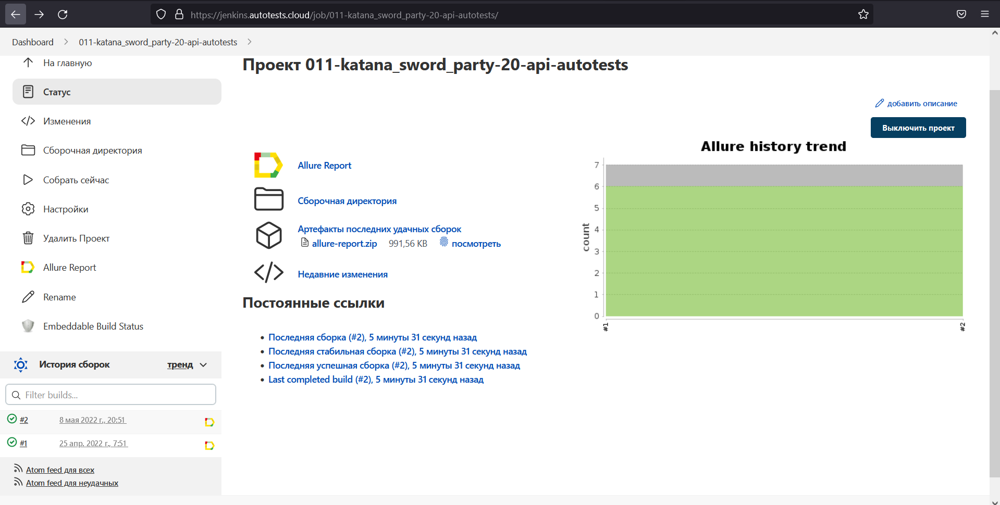
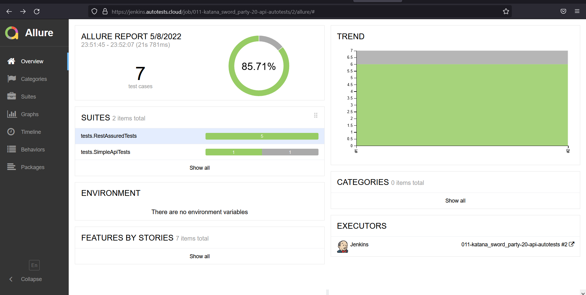
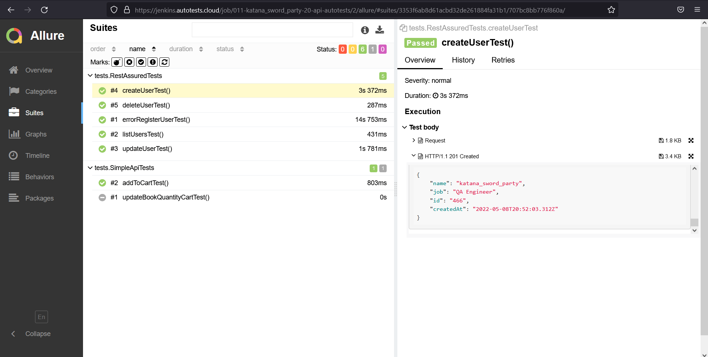

# Проект по автоматизации тестирования для reqres.in
## <a target="_blank" href="https://reqres.in/">Сам сайт</a>

## :japanese_goblin: Содержание:

- <a href="#japanese_goblin-технологии-и-инструменты">Технологии и инструменты</a>
- <a href="#japanese_goblin-реализованные-проверки">Реализованные проверки</a>
- <a href="#japanese_goblin-сборка-в-Jenkins">Сборка в Jenkins</a>
- <a href="#japanese_goblin-allure-отчет">Allure отчет</a>

## :japanese_goblin: Технологии и инструменты

## :japanese_goblin: Реализованные проверки
- Создание пользователя (тесты с использованием моделей и json schema)
- Получение списка пользователей
- Изменение данных пользователя
- Удаление пользователя 
- Возвращение ошибки при введении неправильного пароля
- Редактирование колличества товара в корзине

## :japanese_goblin: Сборка в Jenkins
### <a target="_blank" href="https://jenkins.autotests.cloud/job/011-katana_sword_party-20-api-autotests/">Сборка в Jenkins</a>

## :japanese_goblin: Allure отчет
- ### Главный экран отчета

- ### Страница с проведенными тестами

